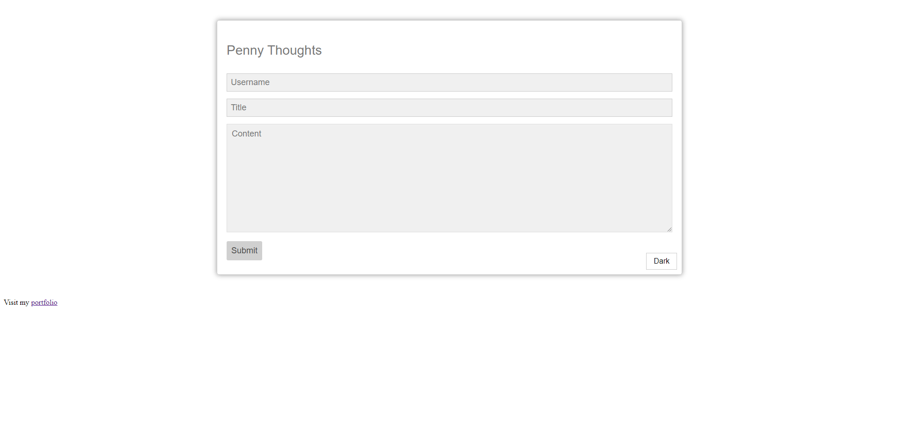
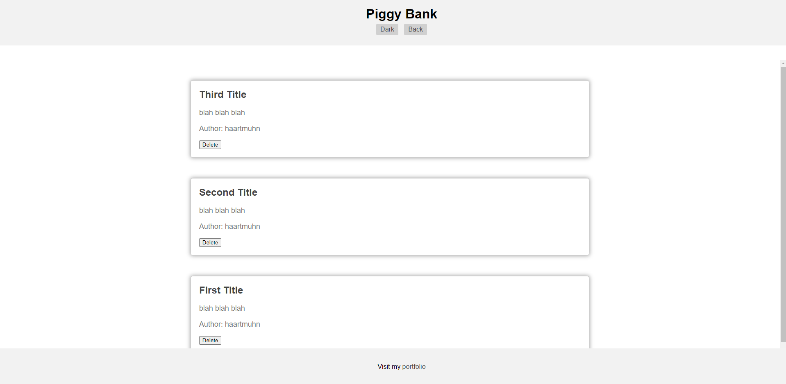

# Penny Thoughts

 

## Desciption 

The Penny Thoughts application is a web-based platform tailored for marketing students who desire to share their insights and experiences with the world. It provides an intuitive interface for creating, storing, and viewing blog posts effortlessly. With features like form validation, light mode/dark mode toggle, and easy navigation, this application offers a seamless blogging experience.

## Usage

1.  Creating a Blog Post: Start by loading the application in your web browser. On the landing page, you'll find a form prompting you to input your username, blog title, and content. Fill in these details and submit the form.
2.  Viewing Blog Posts: After submitting a blog post, you'll be redirected to the posts page where you can see all your blog entries. Each entry includes the title, content, and author's name.
3.  Customizing Appearance: The application offers a light mode and dark mode toggle for comfortable reading. Simply click on the toggle to switch between modes according to your preference.
4.  Navigating Between Pages: Use the "Back" button to return to the landing page from the posts page. This allows you to input more blog entries or make changes to existing ones easily.
5.  Exploring Blog Entries: Click on any blog entry to view its details. You can read the entire content and see who authored the post.
6.  Feedback and Support: If you have any feedback, suggestions, or encounter any issues while using the application, feel free to reach out to the developer. Your input is valuable for enhancing the application's functionality and user experience.

The following image shows the web application's appearance and functionality: 

[Visit my website](https://haartmuhn.github.io/penny-thoughts/)

## License 

[MIT License](https://opensource.org/licenses/MIT)